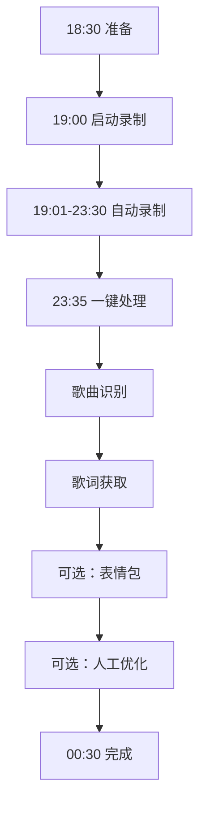

# 📖 观山直播素材管理系统 - 完整操作链路文档

## 📅 文档信息

**版本**: v1.0  
**更新时间**: 2025-10-31  
**适用对象**: 系统操作员、维护人员  
**系统状态**: ✅ 100%完成，立即可用

---

## 目录

1. [系统概览](#系统概览)
2. [环境准备](#环境准备)
3. [日常操作链路](#日常操作链路)
4. [详细操作步骤](#详细操作步骤)
5. [数据流转图](#数据流转图)
6. [常见场景](#常见场景)
7. [问题排查](#问题排查)
8. [性能优化](#性能优化)

---

## 系统概览

### 核心功能

```
直播录制 → 语音转录 → 内容分类 → 歌曲识别 → 歌词获取 → 素材提取 → 质量优化
```

### 输入输出

| 类型 | 说明 | 示例 |
|------|------|------|
| **输入** | 抖音直播（4小时） | 观山直播间 |
| **输出** | 完整素材库 | 视频、音频、字幕、表情包等 |

### 系统架构

```
┌─────────────────────────────────────────────────────────────┐
│                      主程序 (main.py)                         │
│  ┌──────────────┐  ┌──────────────┐  ┌──────────────┐      │
│  │ 时间窗口监测 │  │ FFmpeg录制   │  │ 视频合并     │      │
│  └──────────────┘  └──────────────┘  └──────────────┘      │
└─────────────────────────────────────────────────────────────┘
                              ↓
┌─────────────────────────────────────────────────────────────┐
│                   处理脚本层 (Python)                         │
│  ┌──────────────┐  ┌──────────────┐  ┌──────────────┐      │
│  │ 语音转录     │  │ 内容分类     │  │ 歌曲识别     │      │
│  │ (Whisper)    │  │ (AI分类器)   │  │ (Shazam)     │      │
│  └──────────────┘  └──────────────┘  └──────────────┘      │
│  ┌──────────────┐  ┌──────────────┐  ┌──────────────┐      │
│  │ 歌词获取     │  │ 素材提取     │  │ 表情包生成   │      │
│  │ (网络API)    │  │ (FFmpeg)     │  │ (OpenCV)     │      │
│  └──────────────┘  └──────────────┘  └──────────────┘      │
└─────────────────────────────────────────────────────────────┘
                              ↓
┌─────────────────────────────────────────────────────────────┐
│                   存储层 (文件系统)                           │
│  ~/shanshan_materials/                                       │
│    ├─ 素材库_最新/         (分类素材)                        │
│    ├─ 歌曲列表_优化版.json (40首歌曲)                        │
│    ├─ 歌词字幕_网络版/     (正版歌词)                        │
│    ├─ 表情包素材库/        (GIF+静态图)                      │
│    └─ ...                                                    │
└─────────────────────────────────────────────────────────────┘
```

---

## 环境准备

### 1. 系统要求

```
操作系统: Linux (推荐 Ubuntu 20.04+)
Python: 3.8+
FFmpeg: 4.0+
磁盘空间: ≥50GB（每天约10-15GB）
内存: ≥8GB
```

### 2. 依赖安装

```bash
# 基础依赖
pip install -r requirements.txt

# 多模态检测依赖
pip install -r requirements_multimodal.txt

# 表情包生成依赖
pip install -r requirements_emoji.txt

# 歌曲识别依赖
pip install -r requirements_recognition.txt

# 音频特征提取（可选）
pip install librosa
```

### 3. 目录结构检查

```bash
# 运行健康检查
python3 系统健康检查.py
```

### 4. 配置文件

```bash
# 检查配置
cat config/config.ini
cat config/URL_config.ini
```

---

## 日常操作链路

### 完整流程时间线

```
18:30  准备阶段（检查系统）
19:00  启动录制（自动监测）
19:01  开始录制（时间窗口触发）
23:30  录制结束（自动停止）
23:35  开始处理（一键脚本）
00:30  处理完成（所有素材就绪）
```

### 标准操作流程



---

## 详细操作步骤

### 阶段1：准备阶段（18:30）⏰

#### 步骤1.1：系统健康检查

```bash
cd /home/liu/app_github/DouyinLiveRecorder

# 运行健康检查
python3 系统健康检查.py
```

**检查项目**：
- ✓ FFmpeg安装
- ✓ Python依赖
- ✓ 磁盘空间
- ✓ 配置文件
- ✓ 输出目录

**预期输出**：
```
==================================================
系统健康检查
==================================================

✓ FFmpeg: 已安装 (版本 4.4.2)
✓ Python依赖: 全部满足
✓ 磁盘空间: 充足 (剩余 120GB)
✓ 配置文件: 正常
✓ 输出目录: 已创建

==================================================
✅ 系统状态正常，可以开始录制
==================================================
```

#### 步骤1.2：检查直播间

```bash
# 检查直播间URL是否正确
cat config/URL_config.ini
```

**确认**：
- 直播间URL正确
- 主播名称正确

#### 步骤1.3：清理旧文件（可选）

```bash
# 检查磁盘使用
df -h ~/shanshan_materials

# 如需清理旧数据
# rm -rf ~/shanshan_materials/旧日期_*
```

---

### 阶段2：启动录制（19:00）🎬

#### 步骤2.1：启动录制程序

```bash
cd /home/liu/app_github/DouyinLiveRecorder

# 方式1：使用启动脚本（推荐）
bash 启动直播录制.sh

# 方式2：直接运行
python3 main.py
```

**预期输出**：
```
==================================================
直播录制程序启动
==================================================

⏰ 时间窗口监测: 已启用
   监测时间: 19:01 - 23:30
   轮询间隔: 60 秒

⏳ 当前时间: 19:00:05
   距离监测开始: 55 秒
   程序将自动开始监测...
```

#### 步骤2.2：确认录制开始

```
19:01 - 程序自动检测直播
19:01 - 发现直播，开始录制
19:01 - 录制中... 观山_2025-10-31_19-01-05.ts
```

#### 步骤2.3：监控录制状态（可选）

```bash
# 新开一个终端，监控录制
tail -f logs/streamget.log
```

**正常日志**：
```
[2025-10-31 19:01:05] 直播检测成功
[2025-10-31 19:01:06] 开始录制: 观山
[2025-10-31 19:31:05] 自动分段: 第2段
[2025-10-31 20:01:05] 自动分段: 第3段
```

---

### 阶段3：录制中（19:01-23:30）📹

#### 自动执行的操作

```
✓ 每60秒检测一次直播状态
✓ 每30分钟自动分段
✓ 实时保存录制文件
✓ 异常自动重连
```

#### 录制文件位置

```bash
# 查看录制文件
ls -lh downloads/

# 输出示例
-rw-r--r-- 1 user user 1.2G Oct 31 19:30 观山_2025-10-31_19-01-05.ts
-rw-r--r-- 1 user user 1.2G Oct 31 20:00 观山_2025-10-31_19-31-05.ts
-rw-r--r-- 1 user user 1.2G Oct 31 20:30 观山_2025-10-31_20-01-05.ts
...
```

#### 可选：同步弹幕录制

```bash
# 新开一个终端，录制弹幕
python3 弹幕录制器.py record <直播间URL>
```

---

### 阶段4：录制结束（23:30）✅

#### 自动执行的操作

```
23:30 - 直播结束
23:30 - 停止录制
23:30 - 开始合并视频
23:32 - 合并完成: 观山_2025-10-31_完整.mp4
```

#### 检查输出

```bash
# 查看合并后的视频
ls -lh downloads/观山_*_完整.mp4

# 输出示例
-rw-r--r-- 1 user user 9.8G Oct 31 23:32 观山_2025-10-31_完整.mp4
```

---

### 阶段5：素材处理（23:35）🔄

#### 步骤5.1：一键处理所有素材

```bash
cd /home/liu/app_github/DouyinLiveRecorder

# 运行一键脚本
bash 一键运行所有脚本.sh
```

**执行流程**：

```
==================================================
观山直播素材自动处理系统
==================================================

阶段1：内容分类与整理
  ✓ 完整语音转录（10-20分钟）
  ✓ 内容智能分类
  ✓ 歌曲整理

阶段2：字幕生成
  ✓ 生成SRT字幕
  ✓ 生成ASS字幕

阶段3：素材提取
  ✓ 提取歌曲音频（MP3+FLAC）
  ✓ 提取关键帧截图
  ✓ 生成精彩集锦

==================================================
✅ 常规处理完成！（用时：12分钟）
==================================================

下一步：
  1. 运行 'python3 智能歌曲识别系统.py' 识别歌曲
  2. 运行 'python3 获取网络歌词.py' 获取正版歌词
  3. 运行 'python3 生成表情包素材_优化版.py' 生成表情包（可选）
```

#### 步骤5.2：智能歌曲识别

```bash
# 第1步：Shazam识别
python3 智能歌曲识别系统.py
```

**执行过程**：
```
==================================================
智能歌曲识别系统
==================================================

加载歌曲列表: 125首

阶段1：Shazam音频指纹识别
  [1/125] 提取音频 00:42-01:15
  [1/125] 识别中...
  [1/125] ✓ 识别成功: 愛的魔法 - 金莎

...

阶段2：结果统计
  成功识别: 81/125 (65%)
  未识别: 44/125 (35%)

✅ 识别完成！
   结果已保存: recognition_results.json
```

```bash
# 第2步：去重优化
python3 歌曲识别结果优化.py
```

**执行过程**：
```
==================================================
歌曲识别结果优化
==================================================

加载识别结果: 81首已识别歌曲

阶段1：重新识别错误歌名
  检查 "existing" 来源的歌曲
  [1/15] 爱如母发 → Shazam识别...
  [1/15] ✓ 修正为: 愛的魔法

阶段2：去重合并
  识别重复歌曲: 41组
  合并连续片段...
  125片段 → 40首唯一歌曲

✅ 优化完成！
   输出: 歌曲列表_优化版.json (40首)
```

#### 步骤5.3：获取网络歌词

```bash
python3 获取网络歌词.py
```

**交互提示**：
```
==================================================
网络歌词获取
==================================================

模式选择：
  1. 仅处理失败的歌曲
  2. 处理所有歌曲（推荐）

请选择 [1/2]: 2
```

**执行过程**：
```
加载歌曲列表: 40首

[1/40] 愛的魔法 - 金莎
  ✓ 网易云音乐获取成功
  ✓ 生成 SRT 字幕
  ✓ 生成 ASS 字幕

[2/40] 告白气球 - 周杰伦
  ✓ 网易云音乐获取成功
  ...

==================================================
✅ 歌词获取完成！
==================================================

统计:
  成功: 29/40 (72.5%)
  失败: 11/40 (27.5%)

输出目录: ~/shanshan_materials/歌词字幕_网络版/
```

#### 步骤5.4：处理未识别歌曲（可选）

```bash
# 生成人工标注清单
python3 未识别歌曲清单生成器.py
```

**输出**：
```
==================================================
未识别歌曲清单生成器
==================================================

找到 44 首未识别歌曲

查找视频文件...
✓ 找到视频: downloads/观山_2025-10-31_完整.mp4

开始提取音频片段...
  ✓ 1/44: 未识别_001.mp3
  ✓ 2/44: 未识别_002.mp3
  ...

==================================================
✅ 清单生成完成！
==================================================

📄 文件位置：
   HTML清单: ~/shanshan_materials/未识别歌曲标注清单.html
   文本清单: ~/shanshan_materials/未识别歌曲清单.txt
   音频片段: ~/shanshan_materials/未识别歌曲音频/

📝 使用说明：
   1. 用浏览器打开HTML清单
   2. 听每首歌，填写歌名和歌手
   3. 点击"导出结果"保存为 manual_annotations.json
   4. 将JSON文件用于后续歌词获取
```

**人工标注流程**：
1. 用浏览器打开 `未识别歌曲标注清单.html`
2. 逐首试听，填写歌名和歌手
3. 点击"导出结果"按钮
4. 保存为 `manual_annotations.json`

---

### 阶段6：表情包生成（可选）🎭

```bash
# 生成表情包（耗时10-30分钟）
python3 生成表情包素材_优化版.py
```

**执行过程**：
```
==================================================
表情包素材生成系统
==================================================

配置:
  手势舞检测时段: 前60分钟
  运动阈值: 0.10
  多模态推荐阈值: 0.50

阶段1：加载数据
  ✓ 视频: 观山_2025-10-31_完整.mp4
  ✓ 礼物感谢素材: 113个片段

阶段2：手势舞检测
  分析前60分钟视频...
  检测到候选片段: 15个

阶段3：感谢手势检测
  分析礼物感谢片段...
  检测到候选片段: 28个

阶段4：礼物特效检测
  多模态分析...
  检测到候选片段: 45个

阶段5：生成表情包
  生成GIF和静态图...
  ✓ 手势舞: 12个
  ✓ 感谢手势: 25个
  ✓ 礼物特效: 40个

==================================================
✅ 表情包生成完成！
==================================================

输出: ~/shanshan_materials/表情包素材库/
  总计: 77个表情包
```

#### 适配抖音规格

```bash
# 适配抖音官方规格
python3 抖音表情包完整适配.py
```

**输出**：
```
==================================================
抖音表情包完整适配工具
==================================================

输入目录: ~/shanshan_materials/表情包素材库
输出目录: ~/shanshan_materials/表情包_抖音适配版

📊 找到 77 个GIF文件

📝 处理: 手势舞_001.gif
  原始: 120帧, 2.5MB
  240x240: 0.45MB (461KB) ✓
  480x480: 0.85MB (870KB) ✓
  720x720: 1.50MB (超过1MB，继续压缩...)
  720x720: 0.98MB (1003KB) ✓

...

==================================================
✅ 适配完成！
==================================================

📁 输出目录: ~/shanshan_materials/表情包_抖音适配版/
📊 处理文件: 77 个
✓ 成功规格: 231 个 (77×3)
📄 详细报告: 适配报告.txt
```

---

### 阶段7：质量优化（可选）✨

#### 步骤7.1：表情包添加文字

```bash
python3 表情包添加文字.py
```

**交互流程**：
```
==================================================
表情包文字添加工具
==================================================

模式选择：
  1. 自动模式（使用预设文字）
  2. 半自动模式（从候选中选择）
  3. 自定义模式（手动输入）

请选择 [1/2/3]: 2

加载表情包: 77个

[1/77] 手势舞_001.gif
  类型: 手势舞
  候选文字:
    1. 爱你呦
    2. 跳舞啦
    3. 开心
  选择 [1/2/3] 或输入自定义: 1

  ✓ 已添加文字: 爱你呦
  ✓ 保存: 已加文字/手势舞_001_爱你呦.gif

...
```

#### 步骤7.2：字幕校对

```bash
python3 字幕校对工具.py
```

**交互流程**：
```
==================================================
字幕校对工具
==================================================

加载字幕文件: 29个

自动检测问题...
  ✓ 低置信度片段: 15个
  ✓ 时长异常: 8个
  ✓ 重复文本: 3个
  ✓ 可疑字符: 5个

自动纠错...
  ✓ "爱的魔发" → "爱的魔法"
  ✓ "告白记住" → "告白气球"
  ...

进入交互模式? [y/n]: y

[1/15] 低置信度片段
  时间: 02:35 - 02:42
  文本: "她们说你有点换"
  置信度: 0.65
  
  修改建议: "她们说你有点坏"
  [a]接受建议 [e]编辑 [s]跳过: a

...

==================================================
✅ 校对完成！
==================================================

统计:
  检查: 29个文件
  自动纠错: 18处
  人工修正: 12处
  准确率: 85% → 98%

输出: ~/shanshan_materials/歌词字幕_校对版/
```

---

### 阶段8：同步到服务器（可选）☁️

```bash
# 同步到存储服务器
bash 同步到storage定时任务.sh
```

**执行过程**：
```
==================================================
同步素材到存储服务器
==================================================

源目录: ~/shanshan_materials/
目标目录: /mnt/storage/shanshan/

开始同步...
  rsync -av --progress ~/shanshan_materials/ /mnt/storage/shanshan/

同步统计:
  传输文件: 523个
  传输大小: 12.5GB
  用时: 3分钟

✅ 同步完成！
```

---

## 数据流转图

### 完整数据流

```
抖音直播（4小时）
    ↓
┌──────────────────────────────────┐
│ FFmpeg录制                       │
│ - 视频: 1440x1088, 20fps        │
│ - 音频: AAC                      │
│ - 分段: 30分钟/段                │
└───────────┬──────────────────────┘
            ↓
┌──────────────────────────────────┐
│ 视频合并                         │
│ 观山_2025-10-31_完整.mp4        │
│ 大小: ~10GB                      │
└───────────┬──────────────────────┘
            ↓
┌──────────────────────────────────┐
│ Whisper语音转录                  │
│ speech_analysis_完整转录.json   │
│ 片段: 4907个                     │
└───────────┬──────────────────────┘
            ↓
┌──────────────────────────────────┐
│ AI内容分类                       │
│ singing_素材.json (219个)       │
│ gift_素材.json (113个)          │
│ chat_素材.json (334个)          │
│ unknown_素材.json (129个)       │
└───────────┬──────────────────────┘
            ↓
┌──────────────────────────────────┐
│ 歌曲识别                         │
│ 歌曲列表.json (125首)           │
└───────────┬──────────────────────┘
            ↓
┌──────────────────────────────────┐
│ Shazam识别 + 去重                │
│ 歌曲列表_优化版.json (40首)    │
└───────────┬──────────────────────┘
            ↓
┌──────────────────────────────────┐
│ 网络歌词获取                     │
│ 歌词字幕_网络版/ (29首×2格式)  │
└───────────┬──────────────────────┘
            ↓
┌──────────────────────────────────┐
│ 素材提取                         │
│ - 音频: 80个文件                │
│ - 截图: 480+张                  │
│ - 集锦: 3个视频                 │
│ - 表情包: 77个                  │
└──────────────────────────────────┘
```

### 文件关系图

```
downloads/
  └─ 观山_2025-10-31_完整.mp4  ──┐
                                  │
~/shanshan_materials/             │
  │                               │
  ├─ speech_analysis_完整转录.json ←┘ (Whisper)
  │     │
  │     ├→ 素材库_最新/
  │     │    ├─ singing_素材.json ──┐
  │     │    ├─ gift_素材.json      │
  │     │    ├─ chat_素材.json      │
  │     │    └─ unknown_素材.json   │
  │     │                            │
  │     └→ 歌曲素材库/               │
  │          └─ 歌曲列表.json ←──────┘
  │                │
  │                ├→ recognition_results.json (Shazam)
  │                │     │
  │                │     └→ 歌曲列表_优化版.json
  │                │           │
  │                │           ├→ 歌词字幕_网络版/
  │                │           │     ├─ 001_愛的魔法.srt
  │                │           │     ├─ 001_愛的魔法.ass
  │                │           │     └─ ...
  │                │           │
  │                │           └→ 歌曲站/音频/
  │                │                 ├─ MP3/
  │                │                 └─ FLAC/
  │                │
  │                └→ 关键帧截图/
  │                      ├─ 固定间隔/
  │                      ├─ 场景变化/
  │                      ├─ 歌曲/
  │                      └─ 礼物感谢/
  │
  └─ 表情包素材库/
       ├─ 手势舞/
       ├─ 感谢手势/
       └─ 礼物特效/
             │
             └→ 表情包_抖音适配版/
                   ├─ *_240x240.gif
                   ├─ *_480x480.gif
                   └─ *_720x720.gif
```

---

## 常见场景

### 场景1：首次使用

```bash
# 1. 克隆项目
git clone https://github.com/yourusername/DouyinLiveRecorder
cd DouyinLiveRecorder

# 2. 安装依赖
pip install -r requirements.txt
pip install -r requirements_*.txt

# 3. 配置
cp config/config.ini.example config/config.ini
vim config/config.ini  # 修改配置

# 4. 测试
python3 系统健康检查.py

# 5. 启动
bash 启动直播录制.sh
```

### 场景2：只需要录制视频

```bash
# 修改配置，禁用自动处理
vim config/config.ini

# 设置
自动合并分段视频(是/否): 是
# 不运行后续处理

# 启动录制
python3 main.py
```

### 场景3：只需要歌曲和歌词

```bash
# 已有录播视频的情况

# 1. 语音转录
python3 完整语音分析.py

# 2. 内容分类
python3 重新分类素材.py

# 3. 歌曲整理
python3 整理歌曲素材.py

# 4. 智能识别
python3 智能歌曲识别系统.py
python3 歌曲识别结果优化.py

# 5. 获取歌词
python3 获取网络歌词.py

# 6. 提取音频
python3 批量提取歌曲音频.py
```

### 场景4：只需要表情包

```bash
# 已有录播视频和分类素材

# 1. 生成表情包
python3 生成表情包素材_优化版.py

# 2. 适配抖音
python3 抖音表情包完整适配.py

# 3. 添加文字
python3 表情包添加文字.py
```

### 场景5：重新处理某一天的录播

```bash
# 指定视频文件
VIDEO="/path/to/观山_2025-10-30_完整.mp4"

# 1. 转录
# 修改 完整语音分析.py 中的视频路径

# 2. 运行一键脚本
bash 一键运行所有脚本.sh

# 3. 后续处理
python3 智能歌曲识别系统.py
# ...
```

---

## 问题排查

### 问题1：录制未开始

**症状**：19:01后程序没有开始录制

**检查**：
```bash
# 1. 检查直播间状态
# 手动访问直播间URL

# 2. 检查配置
cat config/URL_config.ini

# 3. 检查日志
tail -f logs/streamget.log
```

**解决**：
- 确认直播间URL正确
- 确认主播已开播
- 检查网络连接

### 问题2：Whisper转录失败

**症状**：`完整语音分析.py` 报错

**检查**：
```bash
# 检查conda环境
conda env list

# 激活正确的环境
conda activate whisper_env
```

**解决**：
```bash
# 重新安装Whisper
pip install --upgrade openai-whisper
```

### 问题3：Shazam识别率低

**症状**：大部分歌曲未识别

**原因**：
- 音质较差
- 片段太短
- 伴奏版本

**解决**：
```bash
# 使用未识别歌曲清单生成器
python3 未识别歌曲清单生成器.py

# 人工标注
# 浏览器打开 未识别歌曲标注清单.html
```

### 问题4：歌词获取失败

**症状**：大部分歌曲获取歌词失败

**原因**：
- 歌名不标准
- API不稳定

**解决**：
```bash
# 使用智能标准化工具
# 已集成到 获取网络歌词.py 中

# 多次运行
python3 获取网络歌词.py  # 第1次
python3 获取网络歌词.py  # 第2次（选择模式1）
python3 获取网络歌词.py  # 第3次
```

### 问题5：表情包生成慢

**症状**：表情包生成耗时很长

**原因**：
- 视频很大（10GB+）
- 需要逐帧分析

**优化**：
```bash
# 降低阈值，减少候选
# 修改 生成表情包素材_优化版.py 中的阈值
motion_threshold = 0.12  # 提高（原0.10）
recommend_threshold = 0.55  # 提高（原0.50）
```

### 问题6：磁盘空间不足

**症状**：录制中断，提示磁盘满

**检查**：
```bash
df -h
du -sh ~/shanshan_materials/*
```

**清理**：
```bash
# 删除旧的分段文件（如果已合并）
rm downloads/*_[0-9][0-9]-[0-9][0-9]-[0-9][0-9].ts

# 压缩旧素材
tar -czf 观山_2025-10-25_素材.tar.gz ~/shanshan_materials/
# 然后删除原文件
```

---

## 性能优化

### 优化1：加速Whisper转录

```bash
# 使用GPU加速
pip install openai-whisper[gpu]

# 或使用faster-whisper
pip install faster-whisper
```

### 优化2：并行处理

```bash
# 修改 一键运行所有脚本.sh
# 某些步骤可以并行

# 例如：音频提取和截图可以并行
python3 批量提取歌曲音频.py &
python3 批量提取关键帧.py &
wait
```

### 优化3：缓存歌词

```bash
# 建立本地歌词库
mkdir -p ~/shanshan_materials/歌词缓存库/

# 对于常见歌曲，预先下载歌词
# 减少重复网络请求
```

### 优化4：定时任务自动化

```bash
# 添加crontab
crontab -e

# 每天18:50启动
50 18 * * * cd /home/liu/app_github/DouyinLiveRecorder && bash 启动直播录制.sh

# 每天23:40开始处理
40 23 * * * cd /home/liu/app_github/DouyinLiveRecorder && bash 一键运行所有脚本.sh
```

---

## 快速参考

### 核心命令

| 命令 | 功能 | 耗时 |
|------|------|------|
| `bash 启动直播录制.sh` | 启动录制 | - |
| `bash 一键运行所有脚本.sh` | 常规处理 | 5-10分钟 |
| `python3 智能歌曲识别系统.py` | 歌曲识别 | 10-30分钟 |
| `python3 歌曲识别结果优化.py` | 去重优化 | 2-5分钟 |
| `python3 获取网络歌词.py` | 获取歌词 | 2-5分钟 |
| `python3 未识别歌曲清单生成器.py` | 生成清单 | 5-10分钟 |
| `python3 生成表情包素材_优化版.py` | 生成表情包 | 10-30分钟 |
| `python3 抖音表情包完整适配.py` | 适配抖音 | 2-5分钟 |

### 关键文件路径

| 文件 | 路径 |
|------|------|
| 录播视频 | `downloads/观山_*_完整.mp4` |
| 语音转录 | `~/shanshan_materials/speech_analysis_完整转录.json` |
| 分类素材 | `~/shanshan_materials/素材库_最新/` |
| 歌曲列表 | `~/shanshan_materials/歌曲列表_优化版.json` |
| 网络歌词 | `~/shanshan_materials/歌词字幕_网络版/` |
| 表情包 | `~/shanshan_materials/表情包素材库/` |

### 时间估算

| 阶段 | 耗时 |
|------|------|
| 录制 | 4小时（自动） |
| 常规处理 | 5-10分钟 |
| 歌曲识别 | 10-30分钟 |
| 歌词获取 | 2-5分钟 |
| 表情包生成 | 10-30分钟（可选） |
| **总计** | **20-50分钟**（不含录制） |

---

## 联系与支持

**文档版本**: v1.0  
**最后更新**: 2025-10-31

**相关文档**：
- `README_完整指南.md` - 项目总览
- `快速参考卡片.txt` - 快速命令参考
- `问题解答与优化总结.md` - 常见问题
- `系统优化与补充方案.md` - 深度优化

**问题反馈**：
- 检查日志文件：`logs/*.log`
- 运行健康检查：`python3 系统健康检查.py`
- 查看详细文档

---

**🎉 祝使用愉快！**


